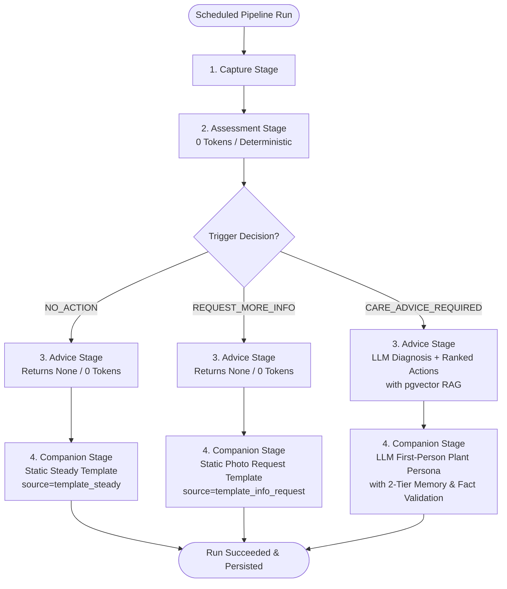

# Pet Plant Server — Post-Implementation Engineering Specification

**Document Version:** 1.0.0
**Status:** Frozen & Fully Implemented
**Date:** October 2026
**Audience:** Core Engineering, MLOps, Mobile / Client Integrations

---

## 1. System Overview

`pet-plant-server` is a modular monolith backend architecture for the Pet Plant autonomous monitoring platform. It connects upstream visual perception (VLM), deterministic botanical rule evaluation, LLM-driven diagnosis and care planning, first-person character dialogue projection, and client action tracking.

### Core Architectural Invariants

1. **Strict Context Isolation:** Each bounded context resides in its own isolated Python package under `src/<context>/` and owns an independent PostgreSQL schema (`auth`, `registry`, `knowledge`, `orchestrator`, `action`, `assessment`, `advice`, `companion`).
2. **No Cross-Schema Foreign Keys:** Tables never declare cross-schema database foreign keys. Relationships across context boundaries are maintained via immutable `UUID` identifiers resolved via in-process published interfaces (`<context>.interface`).
3. **Native UUID & UTC TIMESTAMPTZ:** All table primary keys are native PostgreSQL `UUID` generated by `uuid.uuid4()`. All timestamps are timezone-aware `TIMESTAMPTZ` (`DateTime(timezone=True)`) normalized to UTC.
4. **Deterministic Gatekeeper (0 Tokens):** The `assessment` context executes 100% deterministic rule algorithms without LLM invocation, preventing costly inference runs during steady/healthy states.
5. **pgvector Botanical RAG:** The `knowledge` context embeds species care documentation into 1536-dimensional vectors using `pgvector` for cosine similarity retrieval.
6. **Continuous Pipeline Execution:** If assessment determines `NO_ACTION` or `REQUEST_MORE_INFORMATION`, `advice` returns `None` without raising `StageSkipped`, guaranteeing that the `companion` stage always runs and delivers user-facing dialogue.

---

## 2. PostgreSQL Schema & Data Model Specification

### 2.1 `auth` Schema
- **`auth.users`**:
  - `id`: `UUID` (PK, default `uuid.uuid4`)
  - `email`: `String(255)` (unique, not null, indexed)
  - `hashed_password`: `String(255)` (not null)
  - `name`: `String(120)` (not null)
  - `is_active`: `Boolean` (default True, not null)
  - `is_superuser`: `Boolean` (default False, not null)
  - `created_at`: `TIMESTAMPTZ` (default UTC now, not null)
  - `updated_at`: `TIMESTAMPTZ` (default UTC now, not null)
- **`auth.devices`**:
  - `id`: `UUID` (PK, default `uuid.uuid4`)
  - `device_serial`: `String(128)` (unique, not null, indexed)
  - `claimed_by_user_id`: `UUID` (FK to `auth.users.id`, nullable)
  - `created_at`: `TIMESTAMPTZ` (default UTC now, not null)

### 2.2 `registry` Schema
- **`registry.plant`**:
  - `id`: `UUID` (PK, default `uuid.uuid4`)
  - `owner_id`: `UUID` (not null, indexed) — logical reference to `auth.users.id`
  - `name`: `String(120)` (not null)
  - `species_code`: `String(64)` (nullable)
  - `species_confirmed_at`: `TIMESTAMPTZ` (nullable)
  - `device_id`: `String(128)` (nullable, indexed) — logical reference to `auth.devices.device_serial`
  - `note`: `Text` (nullable)
  - `created_at`: `TIMESTAMPTZ` (default UTC now, not null)
  - `updated_at`: `TIMESTAMPTZ` (default UTC now, not null)
  - `archived_at`: `TIMESTAMPTZ` (nullable)

### 2.3 `knowledge` Schema
- **`knowledge.species`**:
  - `code`: `String(64)` (PK)
  - `common_name`: `String(120)` (not null)
  - `scientific_name`: `String(120)` (not null)
- **`knowledge.research_document`**:
  - `id`: `UUID` (PK, default `uuid.uuid4`)
  - `species_code`: `String(64)` (FK to `knowledge.species.code`, not null)
  - `title`: `String(255)` (not null)
  - `body`: `Text` (not null)
  - `source`: `String(255)` (nullable)
  - `created_at`: `TIMESTAMPTZ` (default UTC now, not null)
- **`knowledge.knowledge_chunks`**:
  - `id`: `UUID` (PK, default `uuid.uuid4`)
  - `species_code`: `String(64)` (not null, indexed)
  - `content`: `Text` (not null)
  - `metadata_json`: `JSONB` (default `{}`)
  - `embedding`: `Vector(1536)` (pgvector cosine index, nullable)
  - `created_at`: `TIMESTAMPTZ` (default UTC now, not null)

### 2.4 `orchestrator` Schema
- **`orchestrator.pipeline_run`**:
  - `id`: `UUID` (PK, default `uuid.uuid4`)
  - `plant_id`: `UUID` (not null, indexed)
  - `scheduled_for`: `TIMESTAMPTZ` (not null, indexed)
  - `trigger`: `String(32)` (default "schedule", not null)
  - `status`: `String(32)` (default "queued", not null, indexed)
  - `current_stage`: `String(64)` (default "capture", not null)
  - `detail`: `Text` (nullable)
  - `created_at`: `TIMESTAMPTZ` (default UTC now, not null)
  - `started_at`: `TIMESTAMPTZ` (nullable)
  - `finished_at`: `TIMESTAMPTZ` (nullable)

### 2.5 `assessment` Schema
- **`assessment.observations`**:
  - `id`: `UUID` (PK, default `uuid.uuid4`)
  - `plant_id`: `UUID` (not null, indexed)
  - `run_id`: `UUID` (not null, indexed)
  - `timestamp`: `TIMESTAMPTZ` (not null)
  - `health_status`: `String(32)` (not null) — `healthy` | `possibly_unhealthy` | `unhealthy`
  - `confidence`: `Float` (not null)
  - `observations_json`: `JSONB` (not null, list of symptom records)
  - `consensus_json`: `JSONB` (nullable, multi-probe consensus results)
  - `image_refs_json`: `JSONB` (not null, list of MinIO image keys)
  - `description`: `Text` (nullable)
  - `companion_message`: `Text` (nullable) — dialogue backfilled by companion stage
  - `created_at`: `TIMESTAMPTZ` (default UTC now, not null)
- **`assessment.trigger_results`**:
  - `id`: `UUID` (PK, default `uuid.uuid4`)
  - `run_id`: `UUID` (unique, not null, indexed)
  - `plant_id`: `UUID` (not null, indexed)
  - `decision`: `String(64)` (not null) — `NO_ACTION` | `REQUEST_MORE_INFORMATION` | `CARE_ADVICE_REQUIRED`
  - `primary_symptom`: `String(128)` (nullable)
  - `confidence`: `Float` (not null)
  - `reasoning`: `Text` (not null)
  - `created_at`: `TIMESTAMPTZ` (default UTC now, not null)
- **`assessment.milestones`**:
  - `id`: `UUID` (PK, default `uuid.uuid4`)
  - `plant_id`: `UUID` (not null, indexed)
  - `run_id`: `UUID` (not null, indexed)
  - `timestamp`: `TIMESTAMPTZ` (not null)
  - `event_type`: `String(64)` (not null) — `first_symptom` | `health_crisis` | `severe_episode` | `near_death` | `full_recovery`
  - `description`: `Text` (not null)
  - `resolved_at`: `TIMESTAMPTZ` (nullable)
  - `created_at`: `TIMESTAMPTZ` (default UTC now, not null)

### 2.6 `advice` Schema
- **`advice.care_plan`**:
  - `id`: `UUID` (PK, default `uuid.uuid4`)
  - `care_plan_id`: `String(64)` (unique, not null, indexed)
  - `plant_id`: `UUID` (not null, indexed)
  - `run_id`: `UUID` (not null, indexed)
  - `status_label`: `String(128)` (not null)
  - `assessment`: `Text` (not null)
  - `confidence`: `Float` (not null)
  - `actions_json`: `JSONB` (nullable, deprecated expand-contract transition column)
  - `created_at`: `TIMESTAMPTZ` (default UTC now, not null)
- **`advice.care_plan_action`** (3NF Normalized Table per OMA-DB):
  - `id`: `UUID` (PK, default `uuid.uuid4`)
  - `care_plan_pk`: `UUID` (FK to `advice.care_plan.id` ondelete `CASCADE`, not null, indexed)
  - `care_plan_id`: `Text` (indexed, logical reference matching care card ID)
  - `action_id`: `Text` (e.g. `act_...`, referenced by `action.care_event`)
  - `priority`: `Integer` (not null, default 1, 1 = most urgent)
  - `action`: `Text` (not null, botanical instruction description)
  - `label`: `Text` (not null, button label for UI)
  - `action_type`: `Text` (not null, `water` | `move` | `inspect` | `other`)
  - `created_at`: `TIMESTAMPTZ` (default UTC now, not null)
- **`advice.diagnosis`**:
  - `id`: `UUID` (PK, default `uuid.uuid4`)
  - `plant_id`: `UUID` (not null, indexed)
  - `run_id`: `UUID` (nullable, indexed)
  - `diagnosis`: `Text` (not null)
  - `created_at`: `TIMESTAMPTZ` (default UTC now, not null)

### 2.7 `companion` Schema
- **`companion.messages`**:
  - `id`: `UUID` (PK, default `uuid.uuid4`)
  - `plant_id`: `UUID` (not null, indexed)
  - `run_id`: `UUID` (not null, indexed)
  - `decision`: `String(64)` (not null)
  - `message`: `Text` (not null)
  - `source`: `String(32)` (not null) — `llm` | `template_steady` | `template_info_request` | `template_fallback`
  - `created_at`: `TIMESTAMPTZ` (default UTC now, not null)

### 2.8 `action` Schema
- **`action.actions`**:
  - `id`: `UUID` (PK, default `uuid.uuid4`)
  - `plant_id`: `UUID` (not null, indexed)
  - `user_id`: `UUID` (not null, indexed)
  - `care_plan_id`: `String(64)` (nullable)
  - `action_type`: `String(64)` (not null) — `water` | `move` | `inspect` | `other`
  - `completed_at`: `TIMESTAMPTZ` (default UTC now, not null)

---

## 3. Public Published Context Interfaces

```
                    ┌────────────────────────────┐
                    │    Orchestrator Stage      │
                    └─────────────┬──────────────┘
                                  │
         ┌────────────────────────┼────────────────────────┐
         ▼                        ▼                        ▼
┌──────────────────┐    ┌──────────────────┐    ┌──────────────────┐
│assessment.interf.│    │ advice.interface │    │companion.interf. │
└────────┬─────────┘    └────────┬─────────┘    └────────┬─────────┘
         │                       │                       │
         ├───────────────────────┤                       │
         ▼                       ▼                       ▼
┌──────────────────┐    ┌──────────────────┐    ┌──────────────────┐
│registry.interface│    │knowledge.interf. │    │  Action Tracking │
└──────────────────┘    └──────────────────┘    └──────────────────┘
```

### 3.1 `assessment.interface`
- `get_trigger_result(session: Session, run_id: UUID) -> TriggerResult | None`
- `get_recent_observations(session: Session, plant_id: UUID, n: int = 7) -> list[ObservationRead]` (Tier 1 Memory)
- `get_previous_observation(session: Session, plant_id: UUID) -> ObservationRead | None`
- `get_milestones(session: Session, plant_id: UUID) -> list[MilestoneRead]` (Tier 2 Episodic Memory)
- `update_companion_message(session: Session, run_id: UUID, message: str) -> None`

### 3.2 `advice.interface`
- `get_care_plan(session: Session, run_id: UUID) -> CarePlanRead | None`
- `get_latest_care_plan_for_plant(session: Session, plant_id: UUID) -> CarePlanRead | None`
- `get_care_plan_actions(session: Session, care_plan_id: str) -> list[CarePlanActionRead]`

### 3.3 `companion.interface`
- `get_latest_message(session: Session, plant_id: UUID) -> CompanionMessageRead | None`
- `get_message_by_run_id(session: Session, run_id: UUID) -> CompanionMessageRead | None`

### 3.4 `knowledge.interface`
- `get_care_knowledge(session: Session, species_code: str, query: str | None = None) -> str | None` (pgvector cosine search)

### 3.5 `registry.interface`
- `get_plant(session: Session, plant_id: UUID) -> PlantRead | None`
- `get_plants(session: Session, plant_ids: list[UUID]) -> dict[UUID, PlantRead]`
- `list_plant_ids(session: Session, owner_id: UUID | None = None, ...) -> list[UUID]`
- `is_plant_owned_by(session: Session, plant_id: UUID, user_id: UUID) -> bool`

---

## 4. Pipeline Execution Logic & Invariants



### Fact Preservation Validation
When `CARE_ADVICE_REQUIRED` invokes the Companion LLM:
1. Significant keywords are extracted from all care plan action strings (excluding common stop words).
2. The LLM response is checked for action coverage: each action must have at least 34% keyword coverage or at least 2 matching keywords.
3. If valid: persisted with `source="llm"`.
4. If invalid (dropped action): deterministic structured fallback template is generated and persisted with `source="template_fallback"`.

---

## 4.1 Multi-Provider LLM Architecture (Ollama & OpenAI)

The server runtime provides unified multi-provider LLM support via `mlops.factory.get_llm()`:
- **Local Self-Hosted (Ollama):** Configured via `LLM_PROVIDER=ollama`, `OLLAMA_HOST=http://localhost:11434`, and `OLLAMA_MODEL=llama3.2:latest` (or `qwen2.5:latest`) using `langchain-ollama.ChatOllama`.
- **Cloud API (OpenAI):** Configured via `LLM_PROVIDER=openai`, `LLM_MODEL=gpt-4o-mini`, and `LLM_API_KEY` using `langchain-openai.ChatOpenAI`.
- **Component Routing:** Both `mlops.advice` and `mlops.companion` seamlessly resolve their chat models through this factory, retaining structured output validation and fallback safety.

---

## 5. Test & Quality Matrix

| Test Suite | File | Count | Status |
| :--- | :--- | :---: | :---: |
| Action API | `tests/action/test_action_api.py` | 8 | PASSED |
| Advice Service | `tests/advice/test_advice_service.py` | 2 | PASSED |
| Assessment Service | `tests/assessment/test_assessment_service.py` | 1 | PASSED |
| Assessment Milestones | `tests/assessment/test_milestones.py` | 4 | PASSED |
| Assessment Rules (Deterministic) | `tests/assessment/test_rules.py` | 9 | PASSED |
| Companion Service | `tests/companion/test_companion_service.py` | 6 | PASSED |
| Companion Validator | `tests/companion/test_validator.py` | 3 | PASSED |
| Core Security, Admin, Storage, Users | `tests/core/` | 30 | PASSED |
| Knowledge API, Generation, Review, Models | `tests/knowledge/` | 49 | PASSED |
| MLOps Knowledge, LLM Factory & Runtime | `tests/mlops/` | 36 | PASSED |
| MLOps LLM Factory (Ollama/OpenAI) | `tests/mlops/test_llm_factory.py` | 2 | PASSED |
| Orchestrator API, Config, Worker | `tests/orchestrator/` | 16 | PASSED |
| Orchestrator E2E 3-Branch Pipeline | `tests/orchestrator/test_pipeline_e2e.py` | 3 | PASSED |
| Registry API & Interface | `tests/registry/` | 20 | PASSED |
| **Total** | **All Tests** | **187** | **100% PASSED** |

- **Ruff Code Style:** 0 errors across all source and test files.
- **Mypy Static Typing:** Strict type-checking passed across 146 source files.
